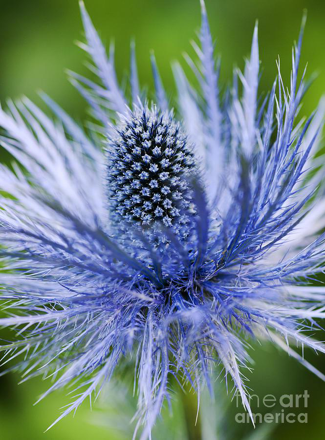
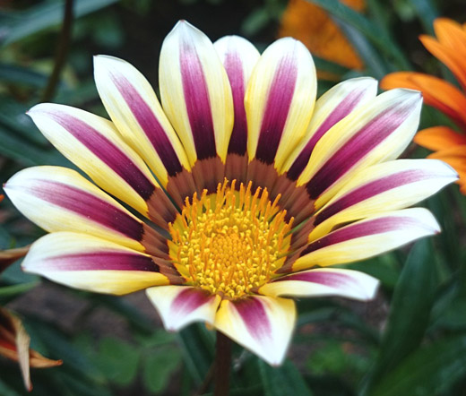
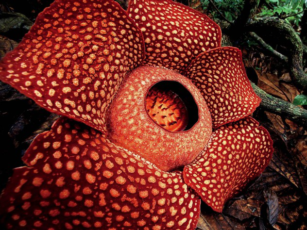
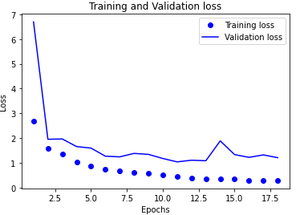
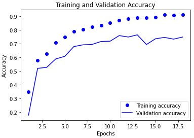
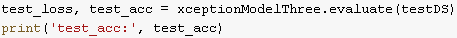

# Practicum I Flower Classification
Flower Classification is definetly not something unheard-of but I wanted to do my own from scratch. This required me to scrape a search engine that I was able to do with the help of a package modified by Joe Clinton. The link to that package is at the very bottom in my reference section. The goal was to get over 100 classes of flowers but due to time contrainst I settled for 90. If you have ever done any kind of web scraping you know that the images you gather aren't always perfect. Common errors I came across in image gathering included wrong formating, non-centered images, and irrelevant photos. In the end I gathered roughtly 10,000 images. The actual split ended up being 7,564 for trainging, 1,811 for validation, and 875 for testing.

## Sample Images
 
 

## List of Classes
alpine_sea_holly - anthurium - azalea - ball_dahlia - balloon_flower - barberton_daisy - beebalm - bird_of_paradise - bishop_of_llandaff - black_eyed_susan - buttercup - californian_poppy - canterbury_bells - carnation - cautleya_spicata - colts_foot - common_colombine - common_dandelion - common_foxglove - common_mallow - common_primrose - corn_poppy - cyclamen - daffodil - daisy - frangipani - fritillary - garden_cosmos - garden_phlox - gardenias - gazania - giant_padma - giant_white_arum_lily - globe_artichoke - globe_flower - globe_thistle - grape_hyacinth - great_masterwort - hard_leaved_pocket_orchid - hibiscus - hydrangeas - indian_blanketflower - iris - japanese_anemone - king_protea - korean_mountain_magnolia - lenten_rose - lilac_hibiscus - lithops_weberi - love_in_the_mist - marigold - monkshood - moon_orchid - morning_glory - passion_flower - peruvian_lily - petunia - pincushion_flower - pink_primrose - pink_quill - poinsettia - prince_of_wales_feathers - purple_coneflower - red_ginger - rose - ruby_lipped_cattleya - siam_tulip - silverbush - snap_dragon - spear_thistle - spring_crocus - stemless_gentian - sunflower - sweet_pea - sweet_william - sword_lily - texas_bluebell - thorn_apple - tiger_lily - toad_lily - travellers_joy - trumpet_creeper - tulip - wallflower - water_lily - watercress_flower - white_gaura - wild_geranium - wild_pansy - yellow_iris

## Modeling
Convolutional Neural Networks(CNN's) are the go to for image recognition so I didn't spend much time thinking about what method I was going to use. I spent a good portion of time however mixing a variation of techniques to improve model performance. Techniques of which include data augmentation, transfer learning, and fine-tuning. At the end of the day the best model I got came from using data augmentation, an Xception base with the top block unfrozen, and a custom classifier. 

## Model Progression
 

## Testing Accuracy

## Web Scraped Data
https://drive.google.com/drive/folders/1YSRnSA3Orec6tTBBakAF53NA3AbVLByP?usp=sharing

## References
https://github.com/Joeclinton1/google-images-download
